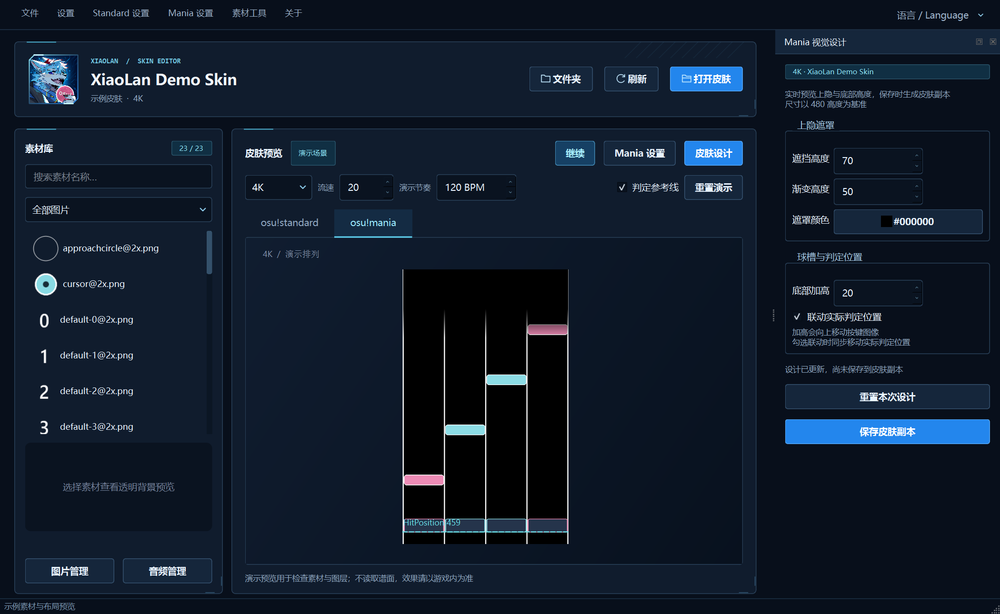
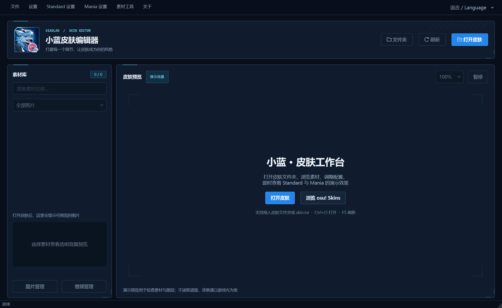

# osu! 小蓝皮肤编辑器 · v1.5

在一个窗口里浏览皮肤素材、调整 Mania 配置、设计上隐与球槽高度，并实时查看 Standard / Mania 演示效果

深蓝与冰青科技风界面，支持中文 / English，适合修改已有皮肤、调试判定图像与制作自己的 Mania 布局

**[下载 Windows x64 版](https://github.com/XiaoLan9999/OsuSkinEditor/releases/download/v1.5/OsuSkinEditor-v1.5-windows-x64.exe)** · [v1.5 发布说明](https://github.com/XiaoLan9999/OsuSkinEditor/releases/tag/v1.5) · [下载源码](https://github.com/XiaoLan9999/OsuSkinEditor/archive/refs/tags/v1.5.zip)

Windows 版下载后直接运行，无需安装 Python



*上图使用演示素材，展示 Mania 播放控制与皮肤设计面板*

## 能做什么

| 功能 | 用法 |
| --- | --- |
| 素材工作台 | 打开或拖入皮肤文件夹，搜索、分类与查看透明图片，试听并替换音频 |
| Standard 预览 | 检查圆圈、覆盖层、数字、缩圈与皮肤光标，支持缩放和暂停 |
| Mania 预览 | 切换键数，调整 1–40 流速与演示 BPM，显示判定参考线、暂停或重置演示 |
| Mania 配置 | 编辑对应键数的轨道与判定配置，保存、读取历史快照或恢复备份 |
| Mania 皮肤设计 | 调整上隐高度、渐变与颜色，抬高底部球槽，可联动判定位置，保存为独立皮肤副本 |

数值框与键数下拉框需先点击才能滚轮修改，失焦后重新锁定，滚动面板时不会因为鼠标经过数值框而误改参数

右上角的 **语言 / Language** 可随时切换界面语言

## 开始使用

1. 运行程序，点击「打开皮肤」，选择**直接包含 `skin.ini` 的文件夹**，也可以将文件夹或 `skin.ini` 拖入窗口
2. 在左侧素材库搜索图片，或进入「图片管理」「音频管理」查看和替换素材
3. 切换到 **osu!mania**，选择要修改的键数，调整流速与演示节奏，打开「判定参考线」检查位置
4. 点击「皮肤设计」，调整上隐、渐变、颜色与底部加高，观察即时预览
5. 点击「保存皮肤副本」，选择新文件夹名称与保存位置
6. 程序会打开保存后的副本，将它作为新的编辑基准，再到 osu! 中选用该副本查看实际效果

保存副本后设计参数会归零，已经写入图片的效果仍然保留，不会重复叠加同一次设计

| 快捷键 | 操作 |
| --- | --- |
| `Ctrl+O` | 打开皮肤 |
| `F5` | 重新加载当前皮肤与素材 |
| `Ctrl+S` | 在 Mania 配置面板内保存配置 |
| `Ctrl+R` | 在 Mania 配置面板内重新读取配置 |

## 上隐、球槽与判定位置

**上隐遮罩**用于遮住轨道上方的一部分，支持调整遮挡高度、渐变长度和颜色，保存时将效果写入副本的 `StageBottom` 衍生图片

**底部加高**通过增加按键图片底部的透明留白，让底部球槽图像上移，默认同时调整 `HitPosition`；取消「联动判定位置」后只移动图像

球槽图片的可见位置和逻辑判定位置是两个不同的设置，图片自身的透明边距也会影响观感，因此仅修改 `HitPosition` 不一定能让图像对齐，可以配合「判定参考线」检查两者关系

设计尺寸使用 osu! 皮肤的 480 高度坐标基准，与窗口中的实际像素大小无关

流速、BPM 和判定参考线仅影响演示预览，不写入 `skin.ini`，也不会修改游戏内的流速设置

## 保存方式与备份

| 操作 | 写入位置 | 原文件处理 |
| --- | --- | --- |
| 「皮肤设计」→「保存皮肤副本」 | 新皮肤文件夹 | 保留原皮肤，只为选中键数生成新素材与配置，不覆盖已有副本 |
| 「Mania 设置」→ 保存 | 当前皮肤的 `skin.ini` | 保留首次配置备份与历史快照 |
| 图片或音频替换、音频冲突整理 | 当前皮肤素材目录，即时写入 | 操作前备份被替换或整理的原文件 |

视觉设计保存会复制皮肤，再生成独立的 `StageBottom` / `KeyImage` 素材，不覆盖其他键数使用的共享原图

如果同时修改了 Mania 配置和视觉设计，保存副本前会先提示处理尚未保存的配置，避免漏掉其中一部分修改

备份均位于对应皮肤目录内

| 路径 | 内容 |
| --- | --- |
| `skin.ini.bak` | 首次保存前的原始配置，后续保存不会覆盖 |
| `.skin_ini_history/` | 配置历史快照，可在 Mania 面板中恢复 |
| `__conflicts_backup/` | 素材替换与音频冲突整理前的原文件 |
| `editor-assets/mania-*/` | 设计副本中生成的独立素材 |

恢复素材时，将备份复制回原位置后按 `F5` 刷新；如果更换过音频格式，也需检查同名不同后缀的文件

## 当前范围

- 预览是用于检查皮肤的演示场景，不读取完整谱面，也不完整模拟长按音符、滑条、转盘、游戏判定或全部皮肤配置
- Mania 演示采用固定速度，不模拟谱面 SV、音乐同步或游戏 Mod，预览不能替代游戏内验证
- 可保存的上隐目前支持**普通下落方向、单舞台 1–9K**
- 底部加高需要皮肤中存在实际的松开与按下按键图片，无法编辑游戏内置的回退图片
- `StageBottom` 导出会保留原图案与全部动画帧，编辑器预览当前显示第一帧
- WAV / OGG / MP3 替换会保留源格式，FLAC 转换需要系统 `PATH` 中的 FFmpeg，程序未附带 FFmpeg
- `.osk` 导入与导出目前仅提供底层 API，尚未接入主界面，使用程序时请打开已解压的皮肤文件夹

v1.5 已通过 **137 项自动化回归测试**，并使用 Capoo 1.5 与 Bochi 圆球 v3.0 完成实际设计导出、重新加载和原文件保持不变的检查，验证范围不包含游戏内实战测试

<details>
<summary>查看启动界面</summary>



</details>

## 从源码运行

需要 Python 3.10 或更新版本，界面使用 PySide6，图像处理使用 Pillow

```powershell
py -m venv .venv
.\.venv\Scripts\python.exe -m pip install -r requirements.txt
.\.venv\Scripts\python.exe app.py
```

运行回归测试

```powershell
.\.venv\Scripts\python.exe -m unittest discover -s tests -v
```

在 Windows 上打包单文件程序

```powershell
.\.venv\Scripts\python.exe -m pip install pyinstaller
.\.venv\Scripts\python.exe -m PyInstaller --noconfirm --clean OsuSkinEditor.spec
```

构建结果位于 `dist/OsuSkinEditor.exe`

`requirements-lock.txt` 记录本次 Windows 构建使用的依赖版本，复现构建环境可使用 Python 3.13，并将安装依赖的命令改为 `pip install -r requirements-lock.txt`

打包规格会在构建进程内隔离无关 SDK 的 `PATH`，避免外部动态库混入，不修改系统环境变量

## 反馈与参考

遇到问题可以[提交 Issue](https://github.com/XiaoLan9999/OsuSkinEditor/issues)，请附上程序版本、皮肤名称、键数、复现步骤，以及编辑器与游戏内的对照截图

[更新记录](CHANGELOG.md) · [osu! skin.ini 说明](https://osu.ppy.sh/wiki/en/Skinning/skin.ini) · [Mania 素材说明](https://osu.ppy.sh/wiki/en/Skinning/osu%21mania) · [头像素材说明](assets/branding/README.md)
