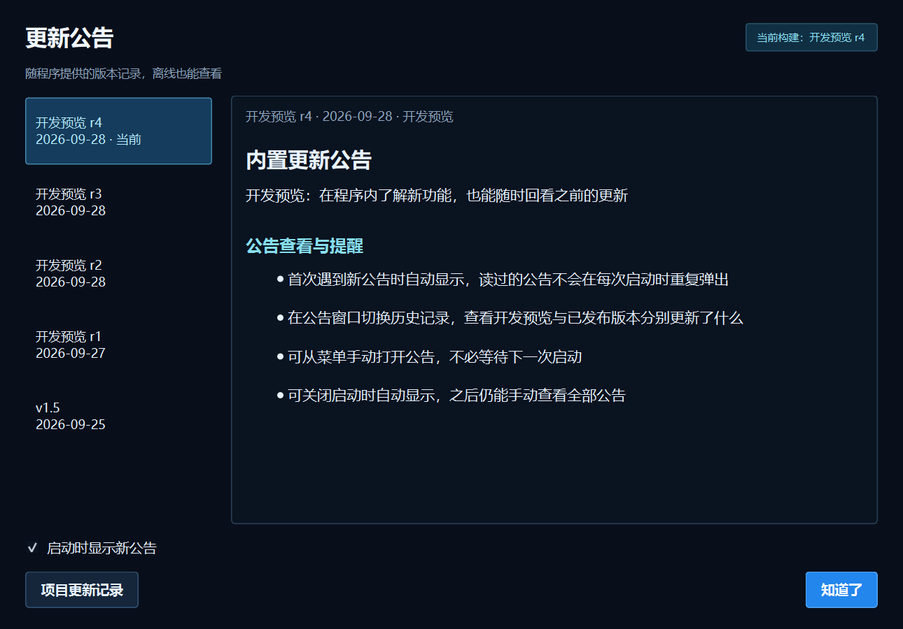
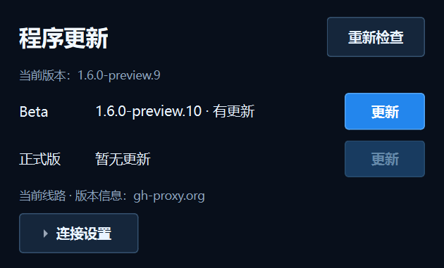
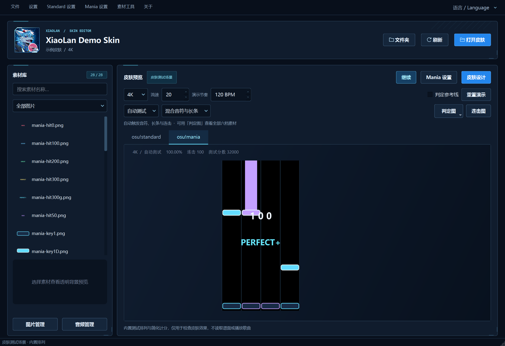
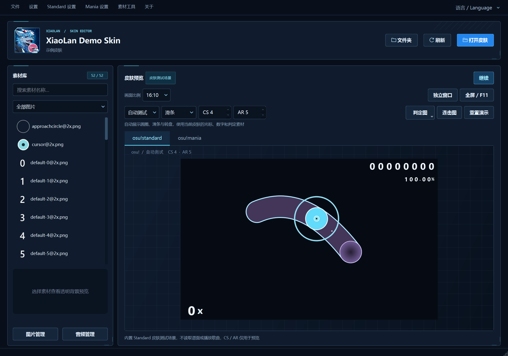
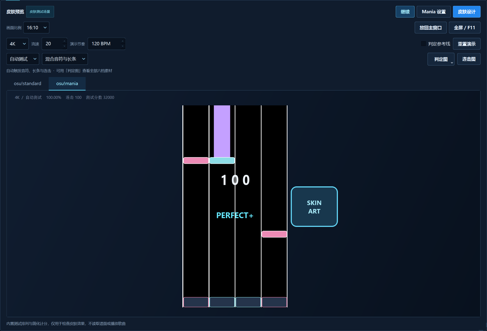
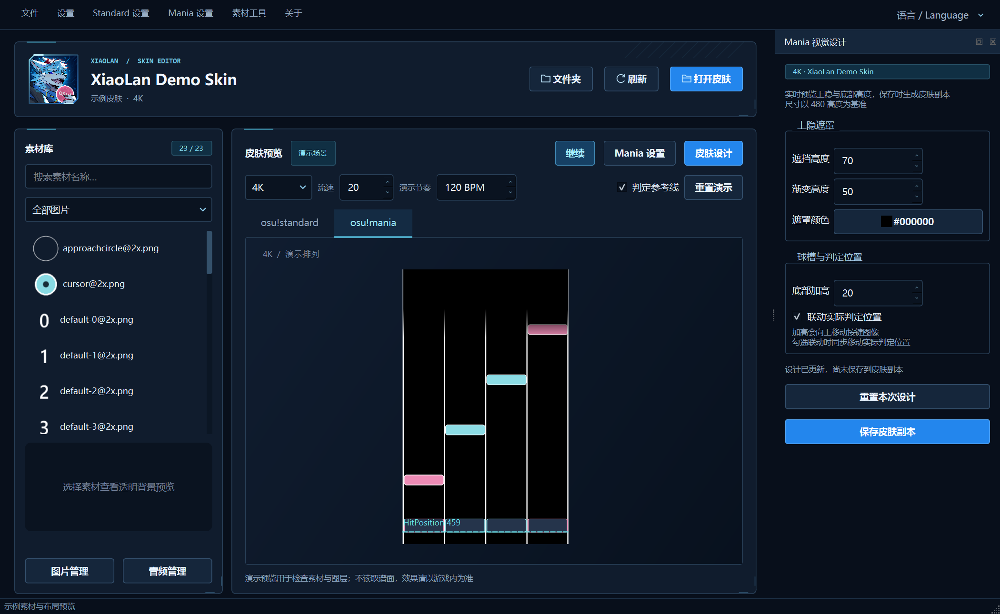
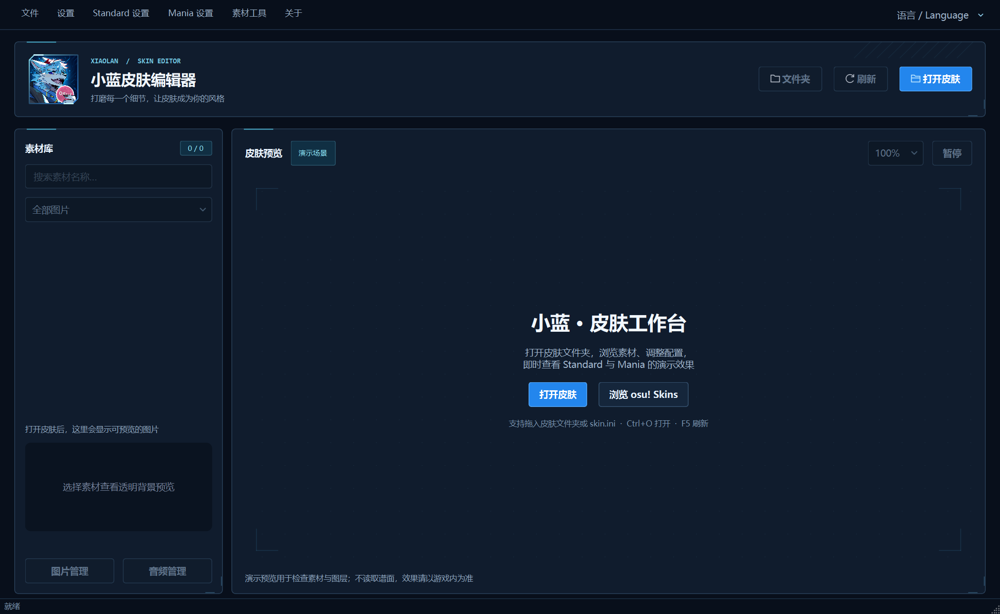

# osu! 小蓝皮肤编辑器

在一个窗口里浏览皮肤素材、调整 Mania 配置、设计上隐与球槽高度，并通过预览与简单试玩检查皮肤效果

深蓝与冰青科技风界面，支持中文 / English，适合修改已有皮肤、调试判定图像与制作自己的 Mania 布局

**[下载已发布的 v1.5 Windows x64 版](https://github.com/XiaoLan9999/OsuSkinEditor/releases/download/v1.5/OsuSkinEditor-v1.5-windows-x64.exe)** · [v1.5 发布说明](https://github.com/XiaoLan9999/OsuSkinEditor/releases/tag/v1.5) · [v1.5 源码](https://github.com/XiaoLan9999/OsuSkinEditor/archive/refs/tags/v1.5.zip)

Windows 版下载后直接运行，无需安装 Python

**[下载 v1.6.0-preview.5 开发预览](https://github.com/XiaoLan9999/OsuSkinEditor/releases/download/v1.6.0-preview.5/OsuSkinEditor-v1.6.0-preview.5-windows-x64.exe)** · [开发预览发布说明](https://github.com/XiaoLan9999/OsuSkinEditor/releases/tag/v1.6.0-preview.5)

**开发预览包含** Mania 键盘试玩与舞台侧图、Standard 自动测试、判定与连击素材检查，以及独立预览窗口，这些功能不在旧版 v1.5 程序中

当前开发预览为 **1.6.0-preview.5 / preview-r5，构建号 5**，包含在线公告与程序更新功能

从 **v1.5 或预览 r1–r4** 升级时，请首次手动下载并运行上面的开发预览，之后可通过程序内的更新入口升级

<details>
<summary>查看内置更新公告</summary>



</details>

## 在线公告与程序更新

「关于」→「更新公告」将**当前版本说明**与**在线公告历史**分开显示，当前 r5 说明随程序打包，离线仍可阅读，历史公告从项目仓库获取，网络不可用时保留本地说明与可用缓存

新公告首次显示后记住已读状态，可取消「启动时显示新公告」，之后仍能从菜单手动查看

安装支持更新的新版后，可在「关于」→「检查程序更新」选择正式版或开发预览通道，依次执行「检查程序更新」「下载新版」「重启并更新」，当前源码默认使用开发预览通道

下载前验证更新清单的 **Ed25519 签名**，下载后验证文件大小与 **SHA-256**，校验通过后才允许替换当前 Windows EXE，更新助手会在程序同目录保留旧版备份，新程序启动失败时尝试恢复旧版，皮肤文件与编辑器设置不参与替换

可以关闭「启动后自动检查公告和程序更新」，手动检查入口仍可使用，自动检查不会自行安装更新

从源码运行时可以检查和下载新版，但不会覆盖 Python 解释器或源码目录，原位置替换仅适用于 Windows 打包程序



*界面示例中的后续版本号不表示已经发布，只有实际下载校验完成后才会启用重启更新*

公告来自仓库的 [announcements.json](https://raw.githubusercontent.com/XiaoLan9999/OsuSkinEditor/main/updates/announcements.json)，签名更新清单来自 [manifest.json](https://raw.githubusercontent.com/XiaoLan9999/OsuSkinEditor/main/updates/manifest.json)，当前没有使用 GitHub Pages

构建与发布维护步骤见 [更新发布说明](docs/UPDATES.md)

## Mania 皮肤测试场景

新测试场景使用当前皮肤和内置排列，方便查看每一列的音符、长条头身尾、按键按下效果、判定图与连击图



| 模式 | 用途 |
| --- | --- |
| 自动测试 | 自动击打 60 秒内置排列，查看普通音符、长条、和弦与连击，结束后重新播放 |
| 键盘试玩 | 点击轨道后用键盘击打，查看判定、连击、测试分数与准确率，`Esc` 或切出场地时暂停 |
| 循环预览 | 保留循环普通音符场景，适合调整轨道与判定位置 |

自动测试与键盘试玩可选择「混合音符与长条」「普通音符」「长条」「和弦」，并调整流速与 BPM，切换排列、键数或 BPM 会重置本轮测试

支持 1–18K，界面显示当前键位，4K 使用 `D F J K`，7K 使用 `S D F Space J K L`，其他键数以场地提示为准

按键仅在点击激活的试玩场地内生效，不会在填写配置时触发音符

点击「判定图」可分别查看 **大 PERFECT / MAX、小 PERFECT、GREAT、GOOD、BAD、MISS** 的皮肤素材，点击「连击图」查看连击数字和皮肤的 `comboburst-mania` 图片，多张连击图可再次点击切换

这些检查会暂停当前测试，不改变试玩成绩，动画素材仍可单独播放

「判定图」→「查看素材映射…」列出当前键数实际加载的图片路径、动画帧数与缺失引用，便于发现某一列误用了同一张图片，或自定义路径没有对应文件

| 皮肤素材 | 读取内容 |
| --- | --- |
| 普通音符与长条 | 各列 `NoteImage#`、`NoteImage#H`、`NoteImage#L`、`NoteImage#T`，以及对应 `mania-note1` / `mania-note2` / `mania-noteS` 默认素材 |
| 按键与灯光 | 各列 `KeyImage#` / `KeyImage#D`，`StageLight`、`LightingN`、`LightingL` |
| 舞台图片 | `StageLeft` / `StageRight` 自定义路径或默认 `mania-stage-left` / `mania-stage-right`，以及舞台前景 `StageBottom` |
| 判定与连击数字 | `Hit300g` / `Hit300` / `Hit200` / `Hit100` / `Hit50` / `Hit0`，`ScorePosition`、`ComboPosition` 与 `[Fonts]` 的 `ComboPrefix` / `ComboOverlap` |
| 连击图片 | `comboburst-mania.png` 或 `comboburst-mania-0.png` 等图片组，按 `ComboBurstStyle` 在轨道侧边显示 |

素材读取支持皮肤子目录、大小写不同的路径、`@2x` 与连续动画帧，动画优先于静态图，缺失素材使用回退效果并在映射中标明，作者提供的透明图片会保持透明

长条按皮肤的 `NoteBodyStyle` 绘制，`RepeatBottom` 保留主体图片顶部，并在长度超出图片时延展底部像素行，不会把超长图片的底端裁切到尾部，Capoo 等皮肤画在主体顶部的圆角与透明留白因此能够保留

长按过程中主体按原始长度绘制，再随按键位置裁切，避免剩余长度变短时重拉伸纹理；尾图的反向锚点和透明图片尺寸也参与定位

连击数字读取 `ColourHold` / `ColourBreak`，长按时变色，命中时纵向弹跳，断连时显示颜色扩散；自动测试与试玩的判定图带缩放和淡出，「判定图」检查则保持原尺寸并独立循环动画

这些规则参考 [osu! 开发者对长条像素延展的说明](https://osu.ppy.sh/community/forums/topics/341098)、[长条几何实现](https://github.com/ppy/osu/blob/master/osu.Game.Rulesets.Mania/Objects/Drawables/DrawableHoldNote.cs)及 [Mania 连击显示实现](https://github.com/ppy/osu/blob/master/osu.Game.Rulesets.Mania/Skinning/Legacy/LegacyManiaComboCounter.cs)，stable 与 lazer 自身仍有[已记录的长条兼容差异](https://github.com/ppy/osu/issues/35502)

### 舞台侧图与画面比例

轨道左右的装饰图会根据皮肤实际的 `StageLeft` / `StageRight` 图片显示，它们与连击时出现的 `comboburst-mania` 是不同素材，侧图会持续显示，不需要先达成连击

侧图横向使用原始皮肤尺寸，纵向按舞台高度绘制，保留透明留白带来的位置关系，舞台前景覆盖在轨道和音符上方，支持舞台底部动画，测试器也可查看侧图的连续动画帧

「画面比例」提供 **16:10、16:9、4:3**，`ColumnStart` 相对虚拟游戏画面定位，窗口变小时整幅场景统一缩放，超出画面的可见侧图和连击图也纳入显示范围，不再把插画单独缩成边栏小图

### Standard 自动测试与素材检查

切换到 **osu!standard** 后可选择「自动测试」，使用当前皮肤展示圆圈、滑条、转盘、光标、血条装饰、数字与判定效果，保留皮肤透明素材，不用其他图案替换作者刻意隐藏的图层

| 测试场景 | 用途 |
| --- | --- |
| 混合场景 | 连续查看圆圈、滑条和转盘的整体搭配 |
| 圆圈 | 查看圆圈、覆盖层、数字与缩圈 |
| 滑条 | 检查滑条相关素材与自动移动效果 |
| 转盘 | 查看转盘素材及自动旋转效果 |

**CS** 调整测试圆圈大小，**AR** 调整缩圈速度，二者仅影响编辑器预览，不写入皮肤或游戏配置

「素材检查」保留单个圆圈场景，可配合 Standard 设置调整数字与图层偏移，自动测试中的「判定图」和「连击图」可暂停并单独查看对应皮肤素材

Standard 使用内置自动排列，目前没有鼠标 / 键盘手动判定，也不读取谱面或播放音乐

血条使用固定示例血量，按原图宽度裁切填色，分数与准确率用于检查字体布局；大幅血条背景和连击插画保持原始比例，超出窗口时随全场一起缩放



### 独立窗口与全屏

点击「独立窗口」可将当前预览连同控制栏移到单独窗口，Mania 与 Standard 共用这个窗口，播放进度和皮肤设置会保留

在独立窗口按 **F11** 可进入或退出全屏，全屏时隐藏编辑控制栏，方便查看画面，关闭独立窗口或选择「放回主窗口」后，预览回到编辑器





*上图使用演示素材，展示 Mania 播放控制与皮肤设计面板*

## 能做什么

| 功能 | 用法 |
| --- | --- |
| 素材工作台 | 打开或拖入皮肤文件夹，搜索、分类与查看透明图片，试听并替换音频 |
| Standard 测试与预览 | 自动展示圆圈、滑条和转盘，调整 CS / AR，单独检查判定、连击与圆圈图层 |
| Mania 测试与预览 | 切换键数，调整 1–40 流速与演示 BPM，自动测试或键盘试玩，单独检查六档判定和连击素材 |
| Mania 配置 | 编辑对应键数的轨道与判定配置，保存、读取历史快照或恢复备份 |
| Mania 皮肤设计 | 调整上隐高度、渐变与颜色，抬高底部球槽，可联动判定位置，保存为独立皮肤副本 |
| 独立预览窗口 | 选择 16:10 / 16:9 / 4:3，统一缩放完整场景，使用 F11 全屏查看 |

数值框与键数下拉框需先点击才能滚轮修改，失焦后重新锁定，滚动面板时不会因为鼠标经过数值框而误改参数

右上角的 **语言 / Language** 可随时切换界面语言

## 开始使用

1. 运行程序，点击「打开皮肤」，选择**直接包含 `skin.ini` 的文件夹**，也可以将文件夹或 `skin.ini` 拖入窗口
2. 在左侧素材库搜索图片，或进入「图片管理」「音频管理」查看和替换素材
3. 切换到 **osu!mania**，选择要修改的键数，调整流速与演示节奏，打开「判定参考线」检查位置，当前 `main` 还可选择「自动测试」或「键盘试玩」检查素材表现
4. 点击「皮肤设计」，调整上隐、渐变、颜色与底部加高，观察即时预览
5. 点击「保存皮肤副本」，选择新文件夹名称与保存位置
6. 程序会打开保存后的副本，将它作为新的编辑基准，再到 osu! 中选用该副本查看实际效果

保存副本后设计参数会归零，已经写入图片的效果仍然保留，不会重复叠加同一次设计

| 快捷键 | 操作 |
| --- | --- |
| `Ctrl+O` | 打开皮肤 |
| `F5` | 重新加载当前皮肤与素材 |
| `Ctrl+S` | 在 Mania 配置面板内保存配置 |
| `Ctrl+R` | 在 Mania 配置面板内重新读取配置 |
| `F11` | 在独立预览窗口切换全屏 |

## 上隐、球槽与判定位置

**上隐遮罩**用于遮住轨道上方的一部分，支持调整遮挡高度、渐变长度和颜色，保存时将效果写入副本的 `StageBottom` 衍生图片

**底部加高**通过增加按键图片底部的透明留白，让底部球槽图像上移，默认同时调整 `HitPosition`；取消「联动判定位置」后只移动图像

球槽图片的可见位置和逻辑判定位置是两个不同的设置，图片自身的透明边距也会影响观感，因此仅修改 `HitPosition` 不一定能让图像对齐，可以配合「判定参考线」检查两者关系

设计尺寸使用 osu! 皮肤的 480 高度坐标基准，与窗口中的实际像素大小无关

流速、BPM、测试模式和判定参考线仅影响编辑器预览，不写入 `skin.ini`，也不会修改游戏内的流速或键位设置

## 保存方式与备份

| 操作 | 写入位置 | 原文件处理 |
| --- | --- | --- |
| 「皮肤设计」→「保存皮肤副本」 | 新皮肤文件夹 | 保留原皮肤，只为选中键数生成新素材与配置，不覆盖已有副本 |
| 「Mania 设置」→ 保存 | 当前皮肤的 `skin.ini` | 保留首次配置备份与历史快照 |
| 图片或音频替换、音频冲突整理 | 当前皮肤素材目录，即时写入 | 操作前备份被替换或整理的原文件 |

视觉设计保存会复制皮肤，再生成独立的 `StageBottom` / `KeyImage` 素材，不覆盖其他键数使用的共享原图

如果同时修改了 Mania 配置和视觉设计，保存副本前会先提示处理尚未保存的配置，避免漏掉其中一部分修改

备份均位于对应皮肤目录内

| 路径 | 内容 |
| --- | --- |
| `skin.ini.bak` | 首次保存前的原始配置，后续保存不会覆盖 |
| `.skin_ini_history/` | 配置历史快照，可在 Mania 面板中恢复 |
| `__conflicts_backup/` | 素材替换与音频冲突整理前的原文件 |
| `editor-assets/mania-*/` | 设计副本中生成的独立素材 |

恢复素材时，将备份复制回原位置后按 `F5` 刷新；如果更换过音频格式，也需检查同名不同后缀的文件

## 当前范围

- 当前 `main` 的 Mania 试玩使用 60 秒内置排列，不导入 `.osu` 谱面、不播放歌曲，也不模拟谱面 SV、音乐同步或游戏 Mod
- 试玩采用简化计分，长条头尾分别判定，提前松开会让尾部判为 MISS，没有游戏中的完整长条计分、血量或奖励分，测试分数不能与 osu! 成绩比较
- 1–18K 均可检查音符，多舞台配置目前按连续轨道显示，尚未完整复刻舞台分离、全部方向翻转选项和所有旧版长条贴图细节
- 长按颜色使用配置原色与 120ms 平滑过渡，断连显示扩散淡出，尚未复刻 stable 的精确颜色过渡曲线与逐数字滚降
- 侧图、舞台前景与连击图使用统一场景缩放，可见图片超出所选游戏画面时会扩大整体取景范围，与游戏窗口边缘直接裁切的效果可能不同
- `ComboBurstStyle: 2` 交替展示两侧以方便检查，未复刻游戏内全部随机与入场动画，侧图连续动画属于测试器扩展
- Standard 为内置自动测试排列与素材检查，包含示例滑条和转盘，没有手动判定、真实谱面、音乐或完整游戏计分，复杂滑条路径与游戏内时序仍需实机确认
- 可保存的上隐目前支持**普通下落方向、单舞台 1–9K**
- 底部加高需要皮肤中存在实际的松开与按下按键图片，无法编辑游戏内置的回退图片
- `StageBottom` 导出会保留原图案与全部动画帧，普通预览播放动画，正在编辑的上隐遮罩使用合成首帧进行预览
- WAV / OGG / MP3 替换会保留源格式，FLAC 转换需要系统 `PATH` 中的 FFmpeg，程序未附带 FFmpeg
- `.osk` 导入与导出目前仅提供底层 API，尚未接入主界面，使用程序时请打开已解压的皮肤文件夹

v1.5 已通过 **137 项自动化回归测试**，并使用 Capoo 1.5 与 Bochi 圆球 v3.0 完成实际设计导出、重新加载和原文件保持不变的检查，验证范围不包含游戏内实战测试

<details>
<summary>查看启动界面</summary>



</details>

## 从源码运行

`assets/updates.json` 仅保存当前构建的离线说明，在线历史位于 `updates/announcements.json`，构建身份统一维护在 `core/app_version.py`，更新清单的公钥位于 `core/update_public_key.py`

需要 Python 3.10 或更新版本，界面使用 PySide6，图像处理使用 Pillow，更新签名校验使用 cryptography

```powershell
py -m venv .venv
.\.venv\Scripts\python.exe -m pip install -r requirements.txt
.\.venv\Scripts\python.exe app.py
```

运行回归测试

```powershell
.\.venv\Scripts\python.exe -m unittest discover -s tests -v
```

在 Windows 上打包单文件程序

```powershell
.\.venv\Scripts\python.exe -m pip install pyinstaller
.\.venv\Scripts\python.exe -m PyInstaller --noconfirm --clean --distpath dist/updater OsuSkinUpdater.spec
.\.venv\Scripts\python.exe -m PyInstaller --noconfirm --clean OsuSkinEditor.spec
```

构建结果位于 `dist/OsuSkinEditor.exe`

请先构建更新助手，主程序会将 `dist/updater/OsuSkinUpdater.exe` 一起打包，如果助手位于其他位置，可设置 `OSUSKIN_UPDATER_PATH` 指向该 EXE 后再构建主程序

`requirements-lock.txt` 记录本次 Windows 构建使用的依赖版本，复现构建环境可使用 Python 3.13，并将安装依赖的命令改为 `pip install -r requirements-lock.txt`

打包规格会在构建进程内隔离无关 SDK 的 `PATH`，避免外部动态库混入，不修改系统环境变量

## 反馈与参考

遇到问题可以[提交 Issue](https://github.com/XiaoLan9999/OsuSkinEditor/issues)，请附上程序版本、皮肤名称、键数、复现步骤，以及编辑器与游戏内的对照截图

[更新记录](CHANGELOG.md) · [更新发布维护](docs/UPDATES.md) · [osu! skin.ini 说明](https://osu.ppy.sh/wiki/en/Skinning/skin.ini) · [Mania 素材说明](https://osu.ppy.sh/wiki/en/Skinning/osu%21mania) · [头像素材说明](assets/branding/README.md)
